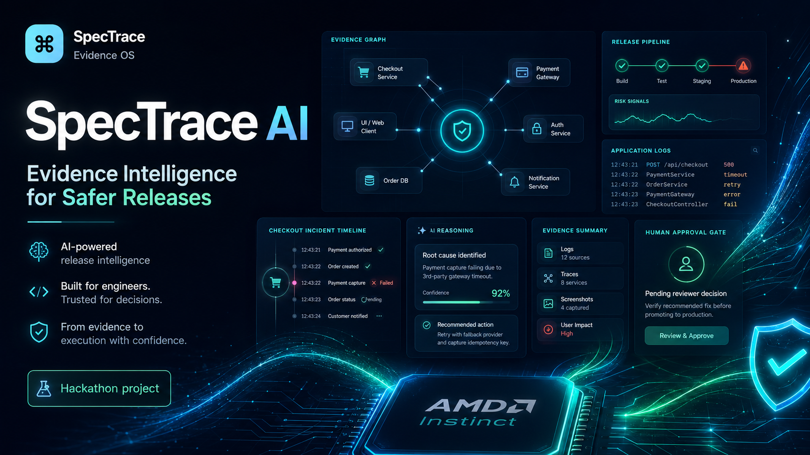

<p align="center">
  
</p>

# SpecTrace AI — Evidence Intelligence for Safer Software Releases

<p align="center">
  <strong>AMD Developer Hackathon ACT II · Unicorn Track</strong><br />
  Evidence Intelligence · Fireworks AI · .NET · Next.js · FastAPI · AMD/Gemma-ready architecture
</p>

SpecTrace AI is an AI-powered evidence intelligence workspace for engineering, QA, SRE, and product teams.

It turns fragmented release evidence — application logs, incident context, screenshots, videos, and customer-impact signals — into traceable root-cause hypotheses, AI reviewer summaries, engineering action plans, generated QA assets, and human release decisions.

> Current demo status: SpecTrace has a working full-stack investigation workflow with Fireworks AI serverless enrichment and deterministic fallback safety. The AMD Developer Cloud / ROCm execution path is planned for the AMD credit phase and is intentionally not falsely claimed as active until it is actually running.

---

## Why SpecTrace Exists

Modern software teams ship quickly, but release decisions often depend on scattered evidence:

- Logs in one place
- QA notes in another
- Customer tickets in support tools
- Screenshots and videos in chat
- AI summaries that are not linked to proof

SpecTrace creates a release intelligence layer that keeps every conclusion connected to evidence.

Instead of asking:

> “What does this incident mean?”

SpecTrace helps teams answer:

> “Is this release safe to ship, what proof do we have, what should engineering do next, and who approved the decision?”

---

## Project Media

- **Thumbnail / Cover:** `docs/media/spectrace-thumbnail.png`
- **Demo Video:** `PASTE_DEMO_VIDEO_URL_HERE`
- **Live App:** `PASTE_LIVE_APP_URL_HERE`
- **LabLab Submission:** `PASTE_LABLAB_PROJECT_URL_HERE`
- **Repository:** `https://github.com/BAGHERIFarzad/spectrace-ai`

The project thumbnail is designed to communicate the core SpecTrace story at a glance: evidence graph, release pipeline, AI reasoning, application logs, human approval, and AMD/GPU-ready infrastructure direction.

---

## Core Demo Scenario

The current demo uses a checkout regression:

```text
Customers complete payment successfully,
but remain stuck on the processing screen
and do not receive an order confirmation.
```

SpecTrace detects a payment response-contract mismatch:

```text
Frontend expects: paymentIntentId
Payment service returns: transactionId
```

Then it generates:

- Root-cause hypothesis
- Evidence timeline
- Evidence graph
- AI reviewer summary
- Engineering action plan
- Release decision rationale
- Playwright regression test draft
- GitHub issue draft
- Acceptance criteria draft
- Human approval decision

---

## Current Features

### Evidence Intelligence

- Upload application logs
- Attach incident context
- Extract deterministic technical signals
- Identify runtime errors, response-field mismatches, and API trace signals
- Build evidence-linked investigation reports

### AI Reasoning Layer

- Python FastAPI AI worker
- Fireworks AI serverless inference
- Structured JSON enrichment:
  - Reviewer summary
  - Engineering recommendation
  - Release decision rationale
- Safe fallback if AI worker or remote model is unavailable

### Engineering Workflow

- Generated Playwright test draft
- Generated GitHub issue draft
- Generated acceptance criteria
- Artifact Studio with copy/download
- Human approval gate:
  - Approve release
  - Request changes
  - Block release

### Judge Mode

The UI includes a judge-facing section aligned with the Unicorn Track criteria:

- Creativity and Originality
- Product / Market Potential
- Completeness
- Use of AMD Platforms

### Runtime Strategy

SpecTrace separates the product workflow from the AI runtime:

- Active route: Fireworks AI serverless enrichment
- Fallback route: deterministic local .NET evidence analyzer
- Future route: AMD Developer Cloud / ROCm / Gemma-style inference

### Evaluation Scenarios

SpecTrace is designed for more than one demo:

- Checkout payment confirmation regression
- Screenshot UI error investigation
- Video journey failure detection
- Multi-source release evidence correlation

---

## Architecture

```text
Next.js Web App
        ↓
.NET API Backend
        ↓
Deterministic Evidence Analyzer
        ↓
Python FastAPI AI Worker
        ↓
Fireworks AI Serverless Runtime
        ↓
AI Reviewer Summary + Engineering Action Plan
        ↓
Generated QA Assets + Human Release Decision
```

### Services

```text
apps/web              Next.js frontend
apps/api              .NET API backend
services/ai-worker    Python FastAPI AI worker
docs/                 Architecture, runbook, demo, judging docs
docs/media            Thumbnail and project media
```

---

## Tech Stack

- Next.js
- React
- TypeScript
- .NET API
- C#
- Python
- FastAPI
- Fireworks AI
- OpenAI-compatible API client
- AMD/Gemma-ready AI worker architecture

---

## AMD / Fireworks / Gemma Positioning

SpecTrace is designed for AMD AI workflows.

Current safe demo runtime:

```text
Fireworks AI serverless inference
```

Fallback runtime:

```text
SpecTrace deterministic local fallback
```

Prepared future runtime:

```text
AMD Developer Cloud / ROCm / Gemma-style inference
```

Important note:

SpecTrace does not require a paid Fireworks dedicated deployment for the current demo. The project uses available Fireworks serverless credits safely. Dedicated Gemma deployments are not used unless access is available without adding a payment method.

---

## AMD GPU Access and Runtime Validation

During the AMD Developer Hackathon: ACT II, AMD AI Notebook access was allocated and validated for SpecTrace AI.

The current live demo runs on:

- Vercel frontend
- Render .NET API
- Render Python FastAPI AI worker
- Fireworks AI serverless inference

The AMD AI Notebook environment is prepared for the next runtime phase:

- ROCm/GPU-backed inference experiments
- Gemma-style model routing
- Screenshot evidence analysis
- Video-frame evidence extraction
- Larger multimodal evidence-correlation workloads

This keeps the live submission honest: SpecTrace is fully usable today through the deployed web stack, while AMD GPU infrastructure is validated and ready for future acceleration.

### AMD Validation Screenshots

- `docs/screenshots/amd-ai-notebook-access.png`
- `docs/screenshots/amd-runtime-validation.png`

## Environment Variables

Create:

```text
services/ai-worker/.env
```

Example:

```env
FIREWORKS_API_KEY=your_fireworks_api_key_here
FIREWORKS_MODEL=accounts/fireworks/models/kimi-k2p7-code
```

Never commit `.env`.

The repository ignores:

- `.env`
- `.env.*`
- Python virtual environments
- .NET `bin/` and `obj/`
- Next.js build folders
- Uploaded runtime evidence

---

## Run Locally

### Terminal 1 — .NET API

```powershell
cd "C:\Users\farza\Desktop\All Hackathon\AMD Developer Hackathon Act 2\Code\spectrace-ai"
dotnet run --project apps/api
```

Expected URL:

```text
http://localhost:5166
```

---

### Terminal 2 — Python AI Worker

```powershell
cd "C:\Users\farza\Desktop\All Hackathon\AMD Developer Hackathon Act 2\Code\spectrace-ai\services\ai-worker"
.\.venv\Scripts\Activate.ps1
python -m uvicorn app.main:app --reload --port 8000
```

Expected URL:

```text
http://localhost:8000/docs
```

---

### Terminal 3 — Next.js Web App

```powershell
cd "C:\Users\farza\Desktop\All Hackathon\AMD Developer Hackathon Act 2\Code\spectrace-ai\apps\web"
npm run dev
```

Expected URL:

```text
http://localhost:3000
```

---

## Demo Flow

1. Start the three terminals.
2. Open the web app.
3. Upload `payment-contract-mismatch.log`.
4. Fill the incident form:
   - Title: `Checkout confirmation fails after payment`
   - Description: `Customers complete payment successfully, but remain on the processing screen and do not receive an order confirmation after the latest release.`
   - Release version: `2026.07.05.1`
5. Click `Create evidence investigation`.
6. Show:
   - Root-cause hypothesis
   - AI reasoning layer
   - Engineering action plan
   - Evidence timeline
   - Evidence graph
   - Generated engineering assets
   - Human approval gate
   - Judge Mode section
   - AI Runtime Strategy section
   - Evaluation Scenarios section
   - AMD Platform Integration section

---

## Fallback Safety Test

To prove resilience:

1. Stop the AI worker with `CTRL + C`.
2. Keep the API and web app running.
3. Create a new investigation.

Expected result:

```text
Provider: SpecTrace deterministic fallback
Mode: local-fallback
```

This ensures the demo remains usable even if the remote AI provider is unavailable.

---

## Screenshots to Add

Recommended screenshots for the final README:

1. Landing page / hero section
2. Evidence upload workspace
3. Investigation complete dashboard
4. AI reasoning layer
5. Generated engineering assets modal
6. Judge Mode section
7. AI Routing Strategy section
8. Evaluation Scenarios section
9. Human Approval Gate
10. AMD Platform Integration section

---

## Judging Alignment

### Creativity and Originality

SpecTrace is not a generic chatbot or incident summarizer. It creates evidence-linked release investigations where each conclusion is connected to technical proof.

### Product / Market Potential

Target users:

- QA teams
- Release managers
- SRE teams
- Product engineers
- Engineering managers
- Fintech and e-commerce teams

SpecTrace can become a release intelligence platform for teams that need safer deployments and faster incident triage.

### Completeness

The current prototype has:

- Working frontend
- Working backend
- Working AI worker
- Real Fireworks AI enrichment
- Deterministic fallback
- Generated engineering assets
- Human approval workflow
- Judge-facing alignment section
- Runtime Strategy section
- Evaluation Scenarios section
- Documentation
- Project thumbnail

### Use of AMD Platforms

SpecTrace is designed around AMD AI infrastructure and Fireworks AI credits. The current demo uses Fireworks AI serverless inference safely, while the architecture is prepared for AMD Developer Cloud / ROCm / Gemma-style execution when cloud credits and access are available.

---

## Roadmap Before Final Submission

Completed:

- Working Next.js product UI
- .NET API backend
- Python FastAPI AI worker
- Fireworks AI serverless enrichment
- Deterministic fallback safety
- Judge Mode section
- AI Runtime Strategy section
- Evaluation Scenarios section
- Generated Playwright / GitHub Issue / Acceptance Criteria drafts
- README, architecture docs, runbook, judging alignment docs
- Project thumbnail / cover image

Remaining:

- Final 2-minute demo video
- Final LabLab AI project submission
- Optional deployment link
- Final screenshots inside README
- Final validation with AI worker running and fallback mode tested

Future AMD phase:

- AMD Developer Cloud / ROCm execution
- Gemma-style inference route
- Screenshot evidence analysis
- Video frame extraction
- Cross-source multimodal correlation
- Investigation pack export

---

## Security

Do not commit:

- API keys
- `.env`
- Uploaded evidence
- Build folders
- Virtual environments

Rotate any API key that appears in screenshots or recordings.

---

## Repository Status

SpecTrace is an active hackathon project under development for the AMD Developer Hackathon: ACT II Unicorn Track.
